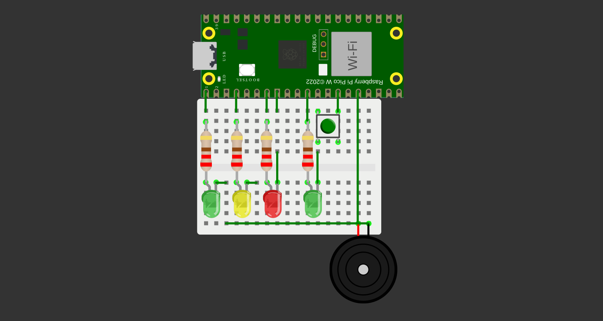

# Pitch
Este é um projeto de um sistema embarcado de um semáforo inteligente, feito em C.
Este projeto é parte da capacitação realizada pelo projeto EmbarcaTech, em parceiria com o IFRN

## Funcionalidades
- O semáforo realiza uma alternância automática entre os sinais verde, amarelho e vermelho (representados por LEDs na protoboard)
- O sistema possui uma integração com um botão, que representa uma interface a ser utilizada por um pedestre
    - Ao ser pressionado, o botão automaticamente altera a configuração do semáforo, permitindo a passagem do pedestre
    - Adicionalmente, foi incluso um sinal sonoro para auxiliar pedestres com deficiências visuais

## Imagens

